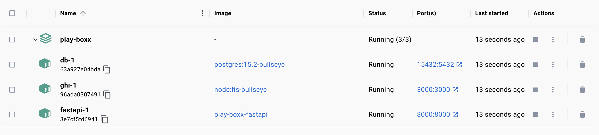

## PlayBoxx

This link leads to a deployed website hosted by CapRover and Gitlab: https://playboxx.gitlab.io/play-boxx/

**Team:**

- @anguswu1022 - Software Developer
- @Gudelfina3 - Software Developer
- @rodrigoolmos - Software Developer
- @spunnanithi - Software Developer

## Design

PlayBoxx is a web application designed as an alternative to flash-based gaming sites for consumers who enjoy playing browser-based games.

- [GHI](docs/ghi.md)
- [API design](docs/apis.md)
- [Data model](docs/data-models.md)
- [Wireframes](docs/wireframes.md)

## Functionality

- Visitors can sign-up for an account, log-in and log-out
- Visitors of the site can choose a game to play on the game page
- Logged-in users can track scores and be able to create scores on the leaderboard to compete with other users of the site
- Creator page to get in touch with the creators or check out their other projects
- Logged-in users of the page are able to view their own top ten scores and edit their information on their profile page

## Installation

**Cloning the repository**

1. In your terminal, navigate to the desired directory where you want the project to be cloned into
2. In your terminal, type `git clone https://gitlab.com/playboxx/play-boxx.git `
3. CD into the new project directory: `cd play-boxx`.

**Run the project locally**

We don't need to create volumes as the docker commands will automatically create volumes for the containers.

1. Run: `docker compose build`
2. Run: `docker compose up`

After these steps, you should see three containers up and running

 

**Accessing FastAPI docs and React.js frontend**

1. To access the FastAPI Swagger UI, navigate to `http://localhost:8000/docs` in your browser
2. To view the React-based frontend, navigate to `http://localhost:3000` in your browser
