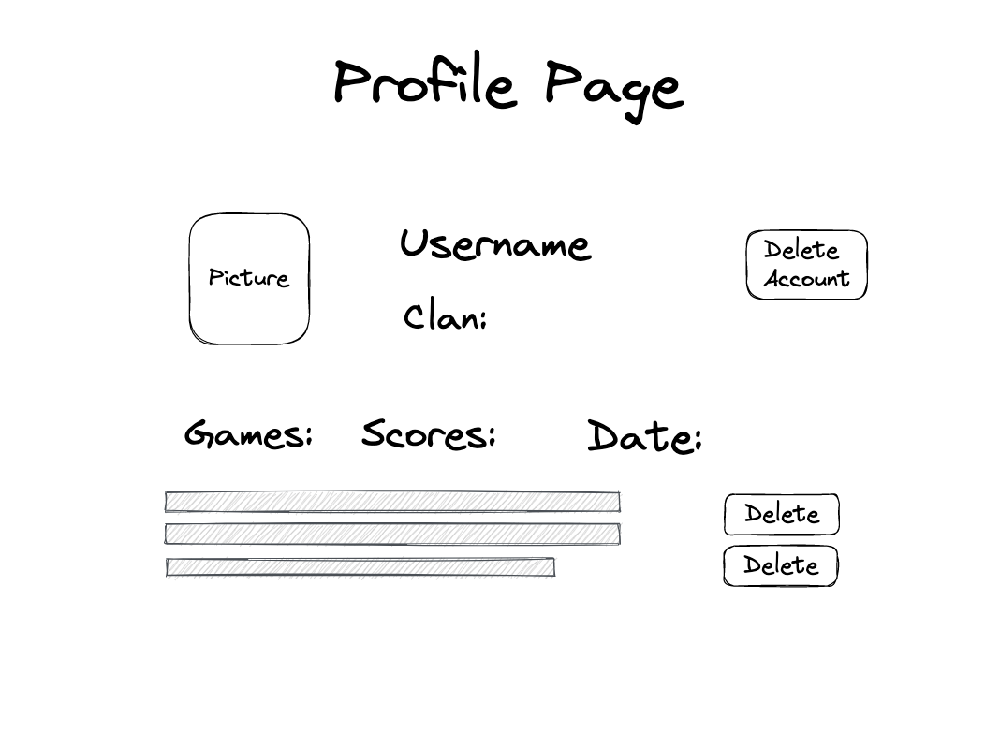
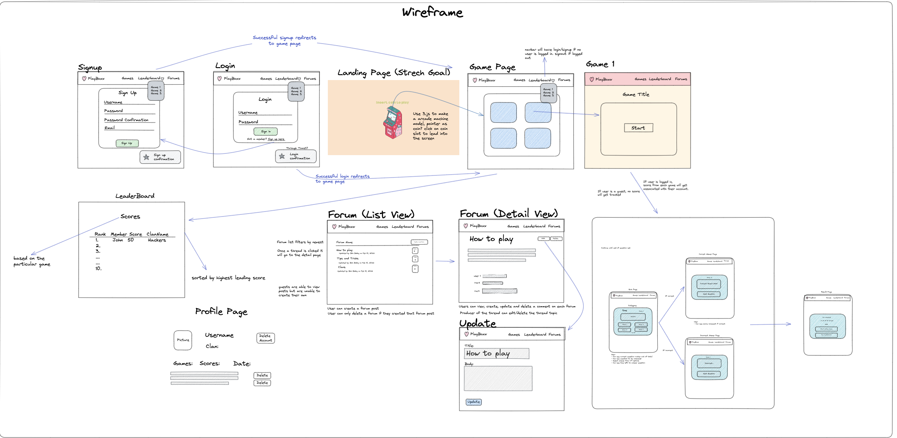

## Wireframes

### These diagrams were created during the exploratory phase of our application development project to create a visual representation of the user interface and functionality.

## Sign-up Page

### This was the intended sign-up page for a user to create an account.

## Login Page

### This was the intended Login page for a user to login into their account.

## Game Page

### This is the page intended to display when a user logs in. This page would show all the games available for the user to select.

## Game Card Display

### This is the intended page when a user selects a game. This page will display the game title, description of the game, and a button to begin the game.

## Quiz Game

## This is the intended page when a user begins the quiz game/selected game. The user can select answers and notify if they are right or wrong. They will also be able to see their incremented score.

## Leaderboard

## This is the intended page when a user finishes a game, their score can be populated into the leaderboard if it meets a top ten score.

## Profile Page

## This is the intended page for a user to see their account information: profile picture, username, and scores

## Full Original Wireframe

